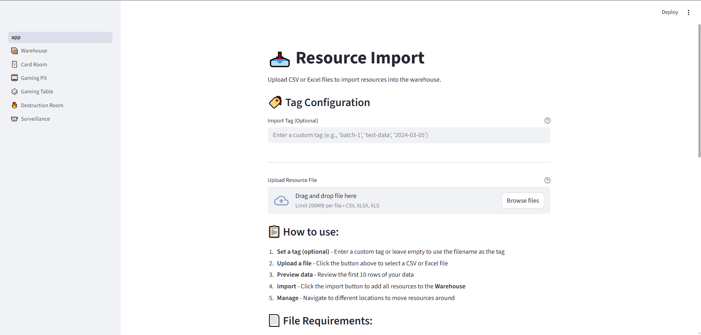
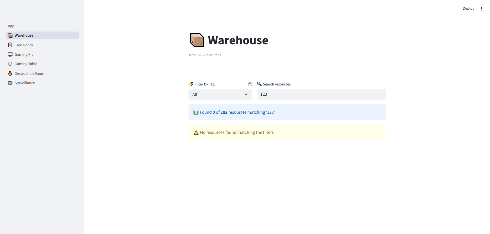

# ResourceTracker

A personal tool for tracking and managing company resources across multiple locations. Built with Python and Streamlit for rapid development and ease of use.

## Features

- **Import Files**: Upload CSV or Excel files (.csv, .xls, .xlsx)
- **6 Location System**: Track resources across warehouse, card room, gaming pit, gaming table, destruction room, and surveillance
- **Move Resources**: Select and move resources between locations
- **Tag-Based Organization**: Auto-tag imports by filename or custom tags
- **Full-Text Search**: Search across all columns in your data
- **Tag Filtering**: Filter resources by import tag
- **Auto-Save**: All changes automatically persist to local JSON file
- **Simple UI**: Clean interface with good UX for quick resource management

## Screenshots

### Home Page - Import & Statistics


The home page provides file upload with tagging options and displays resource statistics across all 6 locations.

### Warehouse Page - Resource Management


Each location page (Warehouse shown here as example) provides tag filtering, search, select all/clear, and bulk move functionality to other locations.

## Locations

Resources can be moved between 6 different locations:

1. **📦 Warehouse** - Default location for all imported resources
2. **🃏 Card Room** - Resources moved to card room
3. **🎰 Gaming Pit** - Resources moved to gaming pit
4. **🎲 Gaming Table** - Resources moved to gaming tables
5. **🔥 Destruction Room** - Resources marked for destruction
6. **📹 Surveillance** - Resources under surveillance

## Installation

1. **Clone or navigate to the project directory**:
   ```bash
   cd D:\Benjamin\ResourceTracker
   ```

2. **Install dependencies**:
   ```bash
   pip install -r requirements.txt
   ```

3. **Run the application**:
   ```bash
   streamlit run app.py
   ```

4. **Open your browser**:
   The application will automatically open at `http://localhost:8501`

## Usage

### 1. Import Resources (📥 Resource Import)

1. Navigate to the home page
2. Optionally enter a custom tag (or leave empty to use filename)
3. Click "Browse files" to upload a CSV or Excel file
4. Preview the first 10 rows of your data
5. Click "Import to Warehouse" to add all resources

### 2. Manage Resources in Locations

1. Navigate to any location page using the sidebar
2. Filter by tag using the dropdown
3. Search for specific resources
4. Select resources by checking the boxes
5. Choose target location and click "Move" to transfer resources

### 3. Track Resource Movement

- Resources start in **Warehouse** upon import
- Move them to other locations as they progress through your workflow
- Each location page shows resources currently at that location
- View statistics on the home page to see resource distribution

## File Requirements

- **CSV Files**: Supports UTF-8, GBK, and Latin1 encodings
- **Excel Files**: Supports both .xls and .xlsx formats
- **No Column Requirements**: All columns are imported as-is
- **Automatic Encoding Detection**: Tries multiple encodings for CSV files
- **Auto-Tagging**: Uses filename as tag if no custom tag provided

## Tagging System

- **Purpose**: Organize resources by import batch
- **Default Tag**: Filename (without extension)
- **Custom Tags**: Enter custom tags during import
- **Filtering**: Filter resources by tag on any location page
- **Examples**:
  - File `test-data.csv` → Tag: `test-data`
  - Custom tag `batch-1` → Tag: `batch-1`

## Data Persistence

All data is automatically saved to `data/resources.json`:
- Changes are saved immediately after import or move operations
- Data persists across application restarts
- JSON format for easy inspection and backup
- Auto-creates the `data/` directory if it doesn't exist
- Backward compatible with old unused/used format (auto-migrates on load)

## Project Structure

```
ResourceTracker/
├── app.py                          # Main entry point (Import page)
├── requirements.txt                # Python dependencies
├── README.md                       # This file
├── .streamlit/
│   └── config.toml                 # Streamlit configuration
├── pages/
│   ├── 2_📦_Warehouse.py          # Warehouse location page
│   ├── 3_🃏_Card_Room.py          # Card room location page
│   ├── 4_🎰_Gaming_Pit.py         # Gaming pit location page
│   ├── 5_🎲_Gaming_Table.py       # Gaming table location page
│   ├── 6_🔥_Destruction_Room.py   # Destruction room location page
│   └── 7_📹_Surveillance.py       # Surveillance location page
├── utils/
│   ├── __init__.py
│   ├── data_manager.py            # Data operations and persistence
│   ├── file_parser.py             # CSV/Excel parsing
│   └── session_manager.py         # Session state management
└── data/
    └── resources.json             # Auto-saved persistence file
```

## Technology Stack

- **Streamlit 1.40+**: Web framework for rapid UI development
- **Pandas 2.2+**: Data manipulation and analysis
- **NumPy 1.24+**: Numerical computing and data type handling
- **OpenPyXL 3.1+**: Excel XLSX file support
- **XLRD 2.0+**: Excel XLS file support

## Tips

- Use descriptive tags to organize imports (e.g., `batch-1`, `2024-03-05`)
- Filter by tag to find specific import batches
- Search across all columns to find specific data
- Select multiple rows to move them in bulk between locations
- Check the home page for overall statistics across all locations
- Your data is automatically saved - no manual save needed
- The application works offline once dependencies are installed

## Troubleshooting

**File upload fails**:
- Check that the file format is CSV, XLS, or XLSX
- For CSV files, try saving with UTF-8 encoding
- Ensure the file is not corrupted

**Data not persisting**:
- Check that you have write permissions in the project directory
- Verify the `data/resources.json` file exists and is accessible

**Application won't start**:
- Ensure all dependencies are installed: `pip install -r requirements.txt`
- Check that Python 3.8+ is installed

**Resources not showing in location**:
- Resources are imported to Warehouse by default
- Check the home page statistics to see where resources are located
- Use the search and filter features on location pages

## License

Apache License 2.0

## Author

Created for personal use in testing company applications.
